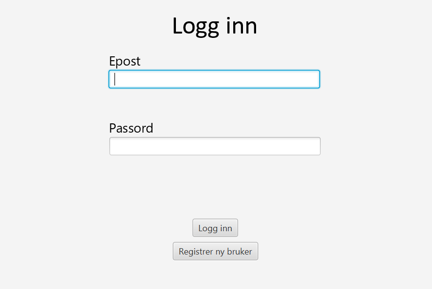
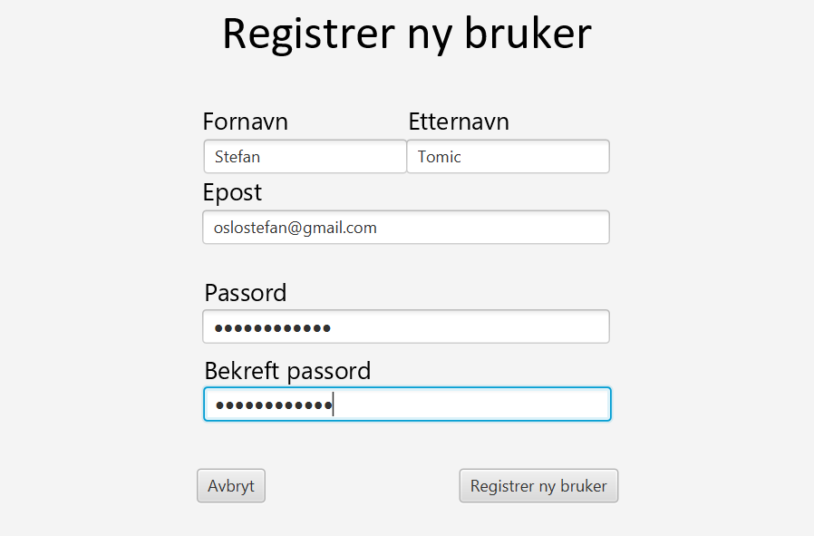
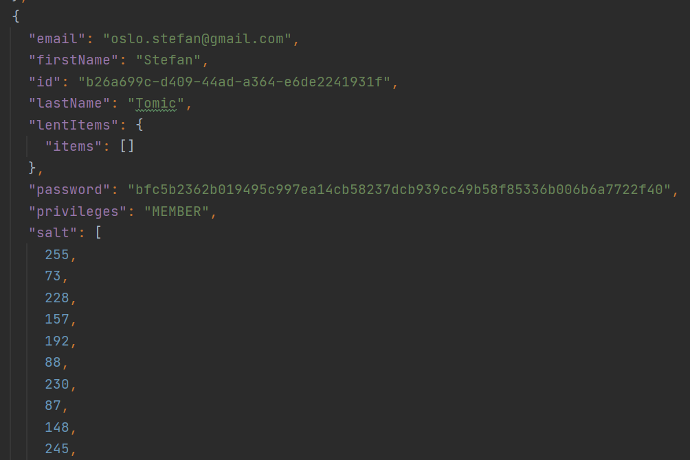
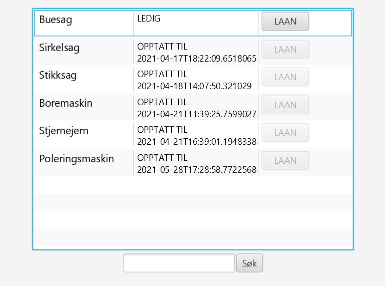

# TDT4100 Project - LendPal

Simple Java project for registering the lending of items. 

Run project using: ``` gradlew run ```

Run tests using: ``` gradlew test ```


### Login


### Register

Email is checked against regex.
It is not possible to use an already registered email address. 
Password is censored and is matched with confirmation.
The password is hashed using SHA256 before it is stored.

### Hash


### ItemList

Item-list is searchable.
